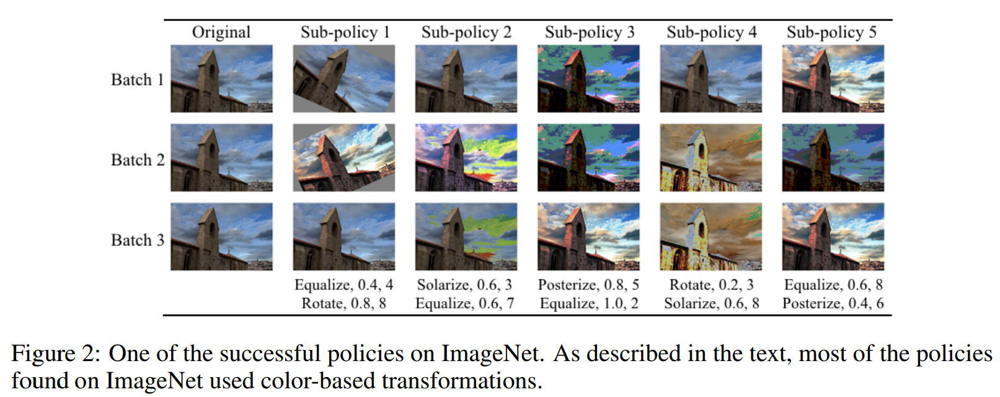
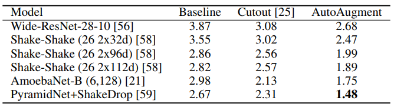
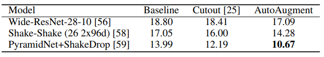
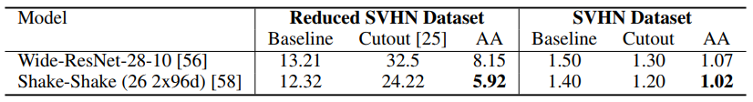
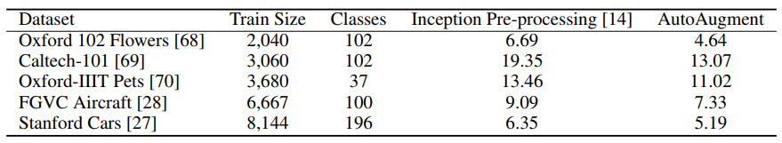

# AutoAugment - Learning Augmentation Policies from Data
Unofficial implementation of the ImageNet, CIFAR10 and SVHN Augmentation Policies learned by [AutoAugment](https://arxiv.org/abs/1805.09501v1), described in this [Google AI Blogpost](https://ai.googleblog.com/2018/06/improving-deep-learning-performance.html).

__Update July 13th, 2018:__ Wrote a [Blogpost](https://towardsdatascience.com/how-to-improve-your-image-classifier-with-googles-autoaugment-77643f0be0c9) about AutoAugment and Double Transfer Learning.

##### Tested with Python 3.6. Needs pillow>=5.0.0




------------------


## Example

```python
from autoaugment import ImageNetPolicy
image = PIL.Image.open(path)
policy = ImageNetPolicy()
transformed = policy(image)
```

To see examples of all operations and magnitudes applied to images, take a look at  [AutoAugment_Exploration.ipynb](AutoAugment_Exploration.ipynb).

## Example as a PyTorch Transform - ImageNet 

```python
from autoaugment import ImageNetPolicy
data = ImageFolder(rootdir, transform=transforms.Compose(
                        [transforms.RandomResizedCrop(224), 
                         transforms.RandomHorizontalFlip(), ImageNetPolicy(), 
                         transforms.ToTensor(), transforms.Normalize(...)]))
loader = DataLoader(data, ...)
```

## Example as a PyTorch Transform - CIFAR10

```python
from autoaugment import CIFAR10Policy
data = ImageFolder(rootdir, transform=transforms.Compose(
                        [transforms.RandomCrop(32, padding=4, fill=128), # fill parameter needs torchvision installed from source
                         transforms.RandomHorizontalFlip(), CIFAR10Policy(), 
			 transforms.ToTensor(), 
                         Cutout(n_holes=1, length=16), # (https://github.com/uoguelph-mlrg/Cutout/blob/master/util/cutout.py)
                         transforms.Normalize(...)]))
loader = DataLoader(data, ...)
```

## Example as a PyTorch Transform - SVHN

```python
from autoaugment import SVHNPolicy
data = ImageFolder(rootdir, transform=transforms.Compose(
                        [SVHNPolicy(), 
			 transforms.ToTensor(), 
                         Cutout(n_holes=1, length=20), # (https://github.com/uoguelph-mlrg/Cutout/blob/master/util/cutout.py)
                         transforms.Normalize(...)]))
loader = DataLoader(data, ...)
```

------------------


## Results with AutoAugment

### Generalizable Data Augmentations

> Finally, we show that policies found on one task can generalize well across different models and datasets. 
> For example, the policy found on ImageNet leads to significant improvements on a variety of FGVC datasets. Even on datasets for
> which fine-tuning weights pre-trained on ImageNet does not help significantly [26], e.g. Stanford
> Cars [27] and FGVC Aircraft [28], training with the ImageNet policy reduces test set error by 1.16%
> and 1.76%, respectively. __This result suggests that transferring data augmentation policies offers an
> alternative method for transfer learning__.

### CIFAR 10



### CIFAR 100



### ImageNet


### SVHN



### Fine Grained Visual Classification Datasets


